# Unscented Kalman Filter

Unscented Kalman Filter implementation to track car's on a highway using lidar and radar data.


Implemented an Unscented Kalman Filter to estimate the state of multiple cars on a highway using noisy lidar and radar measurements.


## Accuracy

RMSE values are always maintained within the tolerance limit as shown in the table below.

| State  | RMSE Threshold  |
| ------ | --------------- |
| X      | 0.30            |
| Y      | 0.16            |
| Vx     | 0.95            |
| Vy     | 0.70            |

Below is UKF in action with RMSE values under threshold


The viewer scene is centered around the ego car and the coordinate system is relative to the ego car as well. The ego car is green while the other traffic cars are of different color. The traffic cars will be accelerating and altering their steering to change lanes. Each of the traffic car's has it's own UKF object generated for it, and will update each indidual one during every time step.

The red spheres above cars represent the (x,y) lidar detection and the purple lines show the radar measurements with the velocity magnitude along the detected angle. The Z axis is not taken into account for tracking, so we are only tracking along the X/Y axis.

The green spheres show the predicted position for the car in the future over a 1 second interval. The bubbles are the number of positions interpolated in the time interval.

## Consistency

### NIS - Normalized Innovation Squared

Below is how resonable filter will estimate the state, from the figure on top we see that the measured value is somewhere within the predicted state covariance.


### Chi-Squared distributions

NIS value follows a distribution called chi-squared distribution which looks as follows.

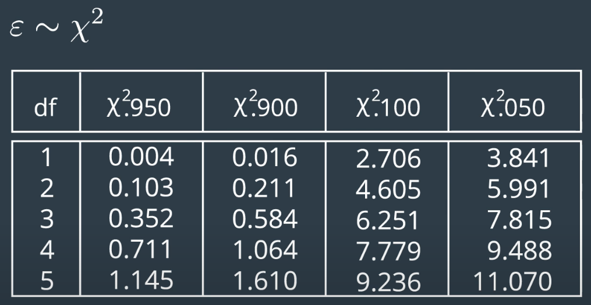

### NIS - Lidar

As seen from the below plot NIS values follows Chi-squared distribution for 2 degrees of freedom i.e., 95% of the time NIS values are less than 5.991.

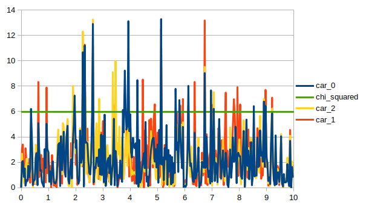

### NIS - Radar

As seen from the below plot NIS values follows Chi-squared distribution for 3 degrees of freedom i.e., 95% of the time NIS values are less than 7.815.

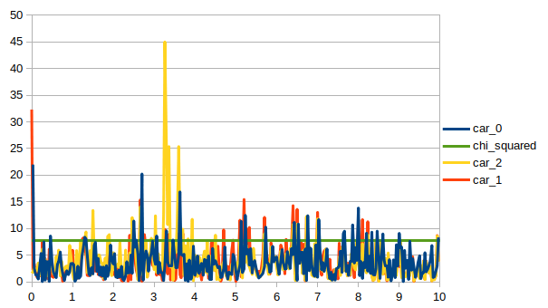

## Evaluation

Comparision of ground truth v/s ukf estimations are as follows.

### Position x

#### Car 0

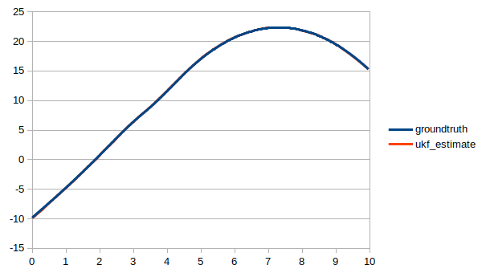

#### Car 1

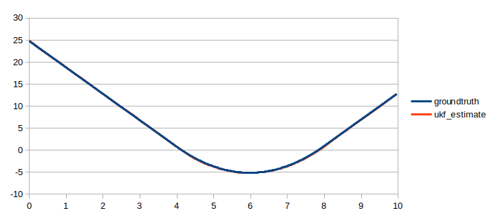

#### Car 2

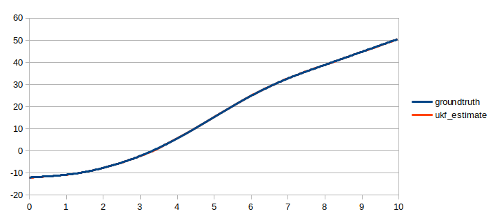

### Position Y

#### Car 0

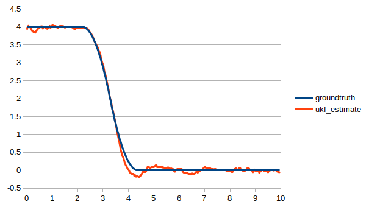

#### Car 1

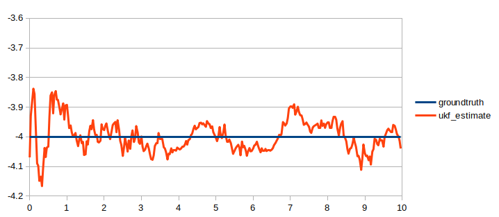

#### Car 2

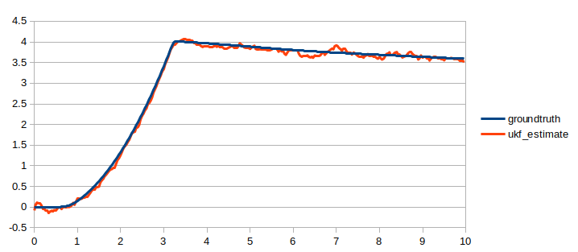

### Velocity

#### Car 0

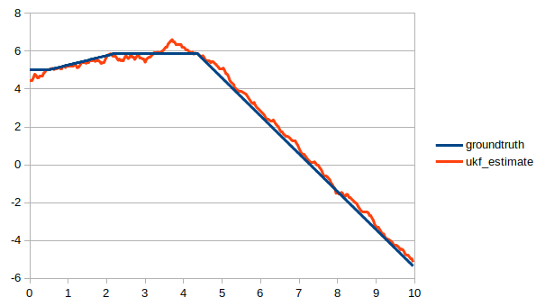

#### Car 1

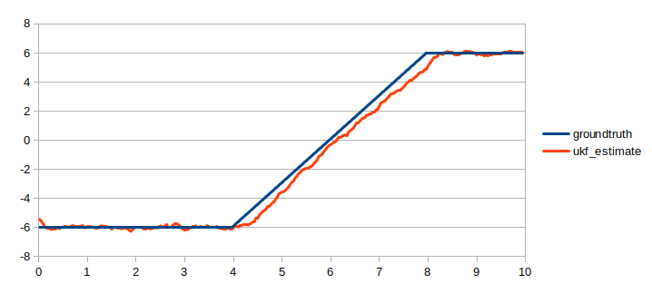

#### Car 2

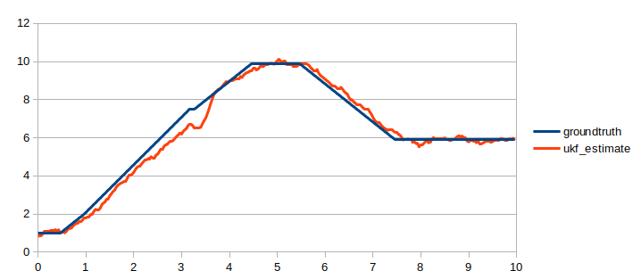

### Yaw

#### Car 0

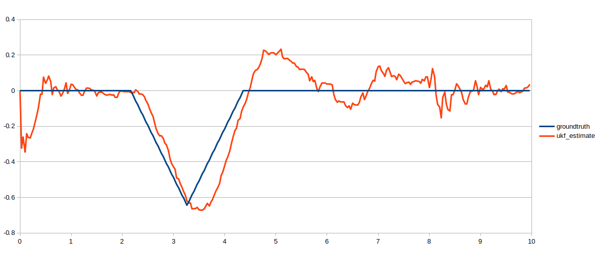

#### Car 1

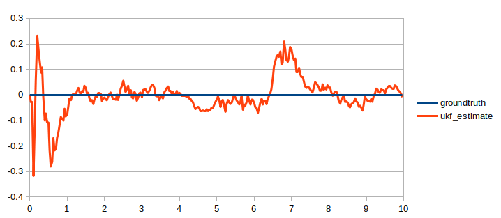

#### Car 2

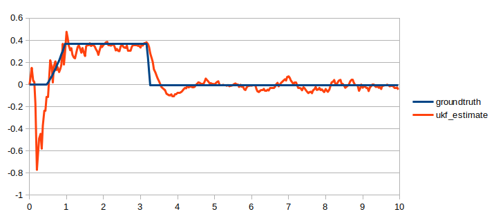

## Dependencies for Running Locally

### Using docker
```
$ docker pull ragumanjegowda/docker:latest
```

### Native (I have not tested this)

* cmake >= 3.5
  * All OSes: [click here for installation instructions](https://cmake.org/install/)
* make >= 4.1 (Linux, Mac), 3.81 (Windows)
  * Linux: make is installed by default on most Linux distros
  * Mac: [install Xcode command line tools to get make](https://developer.apple.com/xcode/features/)
  * Windows: [Click here for installation instructions](http://gnuwin32.sourceforge.net/packages/make.htm)
* gcc/g++ >= 5.4
  * Linux: gcc / g++ is installed by default on most Linux distros
  * Mac: same deal as make - [install Xcode command line tools](https://developer.apple.com/xcode/features/)
  * Windows: recommend using [MinGW](http://www.mingw.org/)
 * PCL 1.8

## Basic Build Instructions

```
$> mkdir build && cd build
$> cmake -G Ninja ..
$> ninja -j400
$> ./ukf_highway
```

## Credits

Based on Udacity's [SFND_Unscented_Kalman_Filter](https://github.com/udacity/SFND_Unscented_Kalman_Filter)
